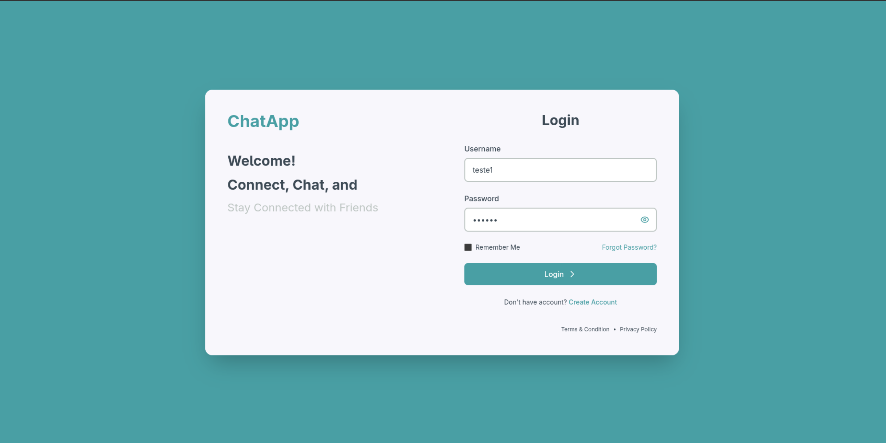
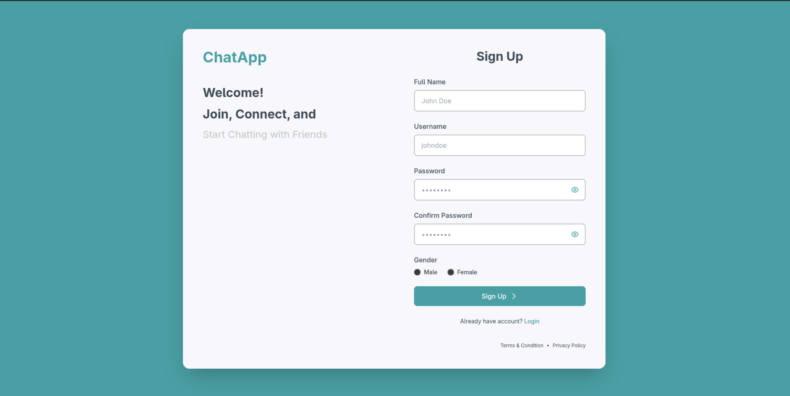
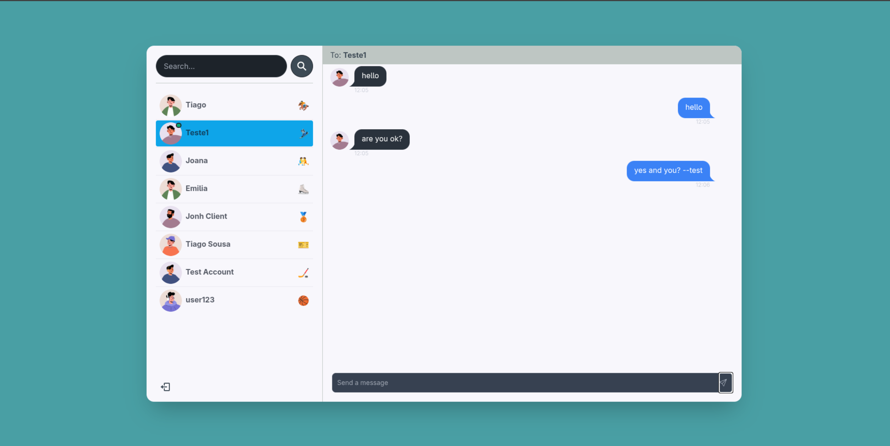

# ChatApp - Real-Time Chat Application

A modern, full-stack real-time chat application built with React and Node.js. This application enables users to register, login, search for other users, and exchange real-time messages in a beautiful, responsive interface.

## 📸 Screenshots

### Login Page


### Sign Up Page


### Chat Interface




## 🚀 Features

- **User Authentication**: Secure registration and login system with JWT tokens
- **Real-Time Messaging**: Instant message delivery using WebSocket (Socket.io)
- **User Search**: Search and find other users to start conversations
- **Online Status**: See which users are currently online
- **Conversation Management**: Organize and manage multiple conversations
- **Responsive Design**: Modern UI that works seamlessly on desktop and mobile devices
- **Beautiful UI**: Custom color palette with Teal, Slate, Tangerine, and Charcoal themes

## 🛠️ Technologies Used

### Frontend
- **React 18.3.1** - UI library
- **React Router DOM 6.28.1** - Client-side routing
- **Vite 6.0.3** - Build tool and development server
- **Tailwind CSS 3.4.17** - Utility-first CSS framework
- **DaisyUI 4.12.22** - Component library for Tailwind
- **Socket.io Client 4.8.1** - Real-time communication
- **React Hot Toast 2.4.1** - Toast notifications
- **React Icons 5.4.0** - Icon library
- **Zustand 5.0.2** - Lightweight state management

### Backend
- **Node.js** - JavaScript runtime
- **Express 4.21.2** - Web framework
- **MongoDB 8.9.2** - NoSQL database
- **Mongoose 8.9.2** - MongoDB object modeling
- **Socket.io 4.8.1** - Real-time bidirectional communication
- **JSON Web Token 9.0.2** - Authentication token management
- **Bcryptjs 2.4.3** - Password hashing
- **Cookie Parser 1.4.7** - Cookie parsing middleware
- **Dotenv 16.4.7** - Environment variable management

## 📁 Project Structure

```
chat-app-yt/
├── backend/
│   ├── controllers/          # Request handlers
│   │   ├── auth.controller.js
│   │   ├── message.controller.js
│   │   └── user.controller.js
│   ├── db/
│   │   └── connectToMongoDB.js  # MongoDB connection
│   ├── middleware/
│   │   └── protectRoute.js   # Authentication middleware
│   ├── models/              # Database models
│   │   ├── user.model.js
│   │   ├── conversation.model.js
│   │   └── message.model.js
│   ├── routes/              # API routes
│   │   ├── auth.routes.js
│   │   ├── message.routes.js
│   │   └── user.routes.js
│   ├── socket/
│   │   └── socket.js        # Socket.io configuration
│   ├── utils/
│   │   └── generateToken.js # JWT token generation
│   └── server.js            # Express server setup
│
├── frontend/
│   ├── public/              # Static assets
│   ├── src/
│   │   ├── components/     # React components
│   │   │   ├── messages/   # Message-related components
│   │   │   ├── sidebar/    # Sidebar components
│   │   │   └── skeletons/  # Loading skeletons
│   │   ├── context/        # React Context providers
│   │   │   ├── AuthContext.jsx
│   │   │   └── SocketContext.jsx
│   │   ├── hooks/          # Custom React hooks
│   │   ├── pages/          # Page components
│   │   │   ├── home/
│   │   │   ├── login/
│   │   │   └── signup/
│   │   ├── utils/          # Utility functions
│   │   ├── zustand/        # Zustand stores
│   │   ├── App.jsx
│   │   └── main.jsx
│   └── package.json
│
└── package.json            # Root package.json
```

## 🔄 Application Flow

### Authentication Flow
1. **Registration**: User creates an account with full name, username, password, and gender
   - Password is hashed using bcrypt before storage
   - JWT token is generated and stored in HTTP-only cookie
   - User profile picture is automatically generated based on gender

2. **Login**: User authenticates with username and password
   - Credentials are verified against hashed password in database
   - JWT token is generated and sent as cookie
   - User is redirected to home page

3. **Protected Routes**: All chat routes require authentication
   - Middleware verifies JWT token from cookies
   - Unauthorized requests are redirected to login

### Real-Time Messaging Flow
1. **Socket Connection**: When user logs in, Socket.io connection is established
   - User's socket ID is mapped to their user ID
   - Online users list is broadcast to all connected clients

2. **Conversation Management**:
   - User searches for other users using the search input
   - Clicking on a user starts/opens a conversation
   - Conversation is created if it doesn't exist between the two users

3. **Message Sending**:
   - User types and sends a message
   - Message is saved to database and linked to conversation
   - Socket.io emits message to receiver's socket if they're online
   - Real-time delivery notification is shown to receiver

4. **Message Reception**:
   - Client listens for 'newMessage' events via Socket.io
   - Messages are displayed in real-time without page refresh
   - Conversation list updates automatically

### User Search Flow
1. User types in search input in sidebar
2. Backend searches for users matching the query
3. Results are displayed in real-time
4. User can click on a result to start conversation

## 🚀 Getting Started

### Prerequisites
- Node.js (v14 or higher)
- MongoDB Atlas account or local MongoDB installation
- npm or yarn package manager

### Installation

1. **Clone the repository**
   ```bash
   git clone https://github.com/tiagosousa10/chat-app-yt.git
   cd chat-app-yt
   ```

2. **Install backend dependencies**
   ```bash
   npm install
   ```

3. **Install frontend dependencies**
   ```bash
   cd frontend
   npm install
   cd ..
   ```

4. **Set up environment variables**

   Create a `.env` file in the root directory:
   ```env
   MONGO_DB_URI=your_mongodb_connection_string
   JWT_SECRET=your_jwt_secret_key
   PORT=5000
   ```

5. **Start the development server**
   ```bash
   # Start backend server (runs on port 5000)
   npm run server

   # In a new terminal, start frontend dev server
   cd frontend
   npm run dev
   ```

6. **Build for production**
   ```bash
   npm run build
   ```

## 📡 API Endpoints

### Authentication
- `POST /api/auth/signup` - Register new user
- `POST /api/auth/login` - Login user
- `POST /api/auth/logout` - Logout user

### Messages
- `GET /api/messages/:id` - Get messages for a conversation
- `POST /api/messages/send/:id` - Send a message

### Users
- `GET /api/users` - Get all users (for search)
- `GET /api/users/:id` - Get user by ID

## 🔐 Security Features

- **Password Hashing**: Passwords are hashed using bcrypt before storage
- **JWT Authentication**: Secure token-based authentication
- **HTTP-Only Cookies**: JWT tokens stored in secure HTTP-only cookies
- **Protected Routes**: Middleware protects sensitive endpoints
- **Input Validation**: Server-side validation for all user inputs

## 🎨 Design System

The application uses a custom color palette:
- **Teal**: `#499fa4` - Primary accent color
- **Slate**: `#bec6c3` - Secondary elements and borders
- **Tangerine**: `#e9bc8b` - Accent highlights
- **Charcoal**: `#3d4a55` - Text and dark elements

## 📱 Features in Detail

### Sidebar
- User search functionality
- List of conversations
- Online status indicators
- Logout button

### Message Container
- Real-time message display
- Message input with send button
- Conversation header showing recipient
- Auto-scroll to latest message
- Empty state when no conversation selected

### Responsive Design
- Mobile-first approach
- Flexible layouts that adapt to screen size
- Touch-friendly interface elements

## 🔧 Development

### Available Scripts

**Root directory:**
- `npm run server` - Start backend server with nodemon
- `npm start` - Start production server
- `npm run build` - Build frontend and install all dependencies

**Frontend directory:**
- `npm run dev` - Start Vite development server
- `npm run build` - Build for production
- `npm run preview` - Preview production build
- `npm run lint` - Run ESLint

## 🤝 Contributing

Contributions are welcome! Please feel free to submit a Pull Request.

## 📝 License

ISC

## 👤 Author

Tiago Sousa

## 🔗 Repository

[GitHub Repository](https://github.com/tiagosousa10/chat-app-yt)

